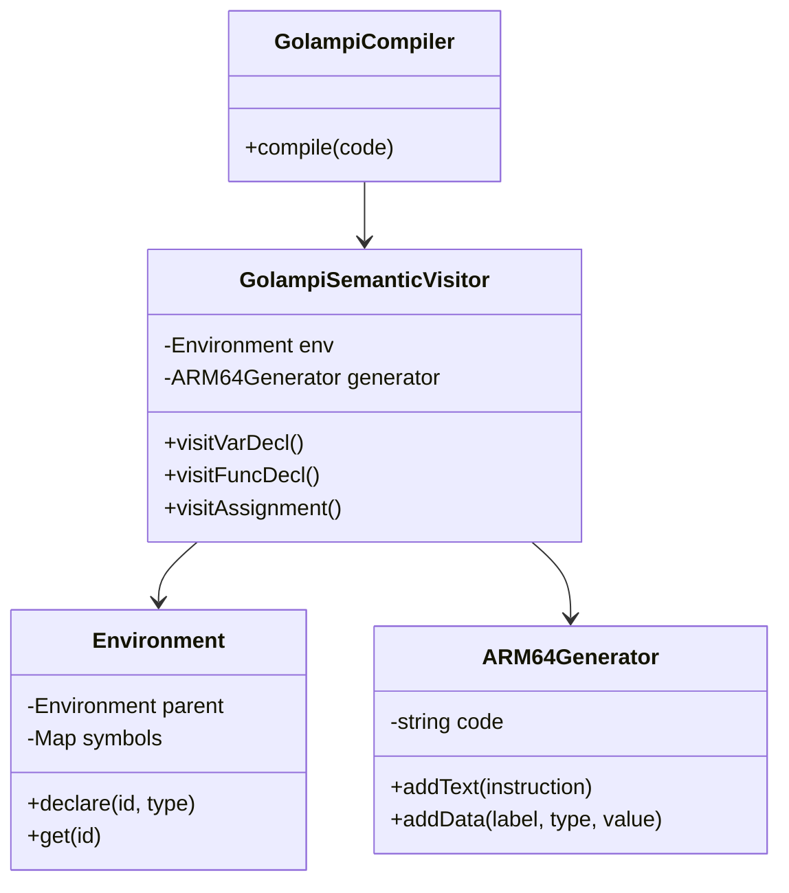
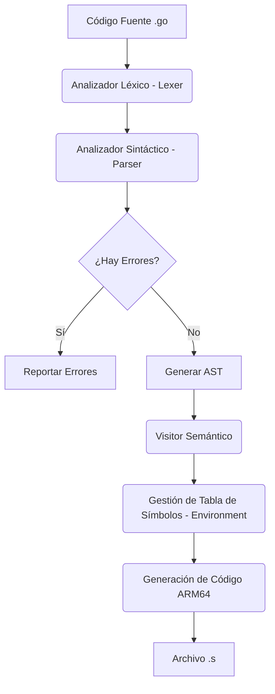

# Manual Técnico - Golampi Compiler

## Arquitectura del Proyecto

El proyecto está diseñado bajo una arquitectura monolítica con una clara separación lógica (Cliente-Servidor).

- **Frontend:** HTML5, CSS3, Vanilla JS. Actúa como vista y manejador de eventos del usuario. No contiene lógica de compilación.
- **Backend:** PHP 8.x. Actúa como controlador y núcleo del compilador.
- **Analizador Lexicográfico y Sintáctico:** ANTLR4 genera clases en PHP (`GolampiLexer`, `GolampiParser`, `GolampiVisitor`) que forman el AST.
- **Generador de Código:** `ARM64Generator.php`.

## Gramática Formal de Golampi

La gramática está definida en formato ANTLR4. A continuación se presentan las reglas principales:

### Reglas de Alto Nivel
```antlr
program: EOF | declarations;

declarations: declaration+;

declaration
    : varDecl
    | constDecl
    | funcDecl
    | statement
    ;
```

### Declaraciones y Tipos
```antlr
varDecl
    : VAR idList type ('=' expList)?
    | VAR idList arraySizes type ('=' arrayLiteral)?
    | idList DECL_ASSIGN expList
    ;

type
    : INT32 | FLOAT32 | BOOL | RUNE | STRING
    | MULT type
    | arraySizes type
    ;
```

### Expresiones
```antlr
expression
    : LPAREN expression RPAREN #parenExpr
    | builtinCall #builtinExpr
    | expression LPAREN expList? RPAREN #callExpr
    | expression ('[' expression ']')+ #indexExpr
    | NOT expression #unaryExpr
    | MINUS expression #unaryExpr
    | expression (MULT | DIV | MOD) expression #mulDivExpr
    | expression (PLUS | MINUS) expression #addSubExpr
    | expression (GT | GTE | LT | LTE) expression #relationalExpr
    | expression (EQ | NEQ) expression #equalityExpr
    | expression AND expression #andExpr
    | expression OR expression #orExpr
    | REF expression #refExpr
    | MULT expression #derefExpr
    | INT_LIT | FLOAT_LIT | STRING_LIT | RUNE_LIT | TRUE | FALSE | NIL | ID
    | arrayLiteral #arrayLitExpr
    ;
```

## Diagrama de Clases

El compilador utiliza un patrón de diseño **Visitor** para recorrer el AST generado por ANTLR4.

> [!NOTE]
> **[INSERTAR AQUÍ IMAGEN DE DIAGRAMA DE CLASES]**
> El diagrama debe mostrar la relación entre `GolampiCompiler`, `GolampiParser`, `GolampiSemanticVisitor`, `Environment` (Tabla de Símbolos) y `ARM64Generator`.

### Estructura de Clases Principal (Mermaid)



## Flujo de Procesamiento y Tabla de Símbolos

El flujo de procesamiento describe cómo el código fuente se transforma en código ensamblador ARM64, gestionando los ámbitos de las variables mediante la Tabla de Símbolos.

> [!NOTE]
> **[INSERTAR AQUÍ IMAGEN DE DIAGRAMA DE FLUJO]**
> El diagrama debe mostrar los pasos: Código Fuente -> Lexer -> Parser -> AST -> Visitor (Semántico + Generación) -> ASM.

### Diagrama de Flujo (Mermaid)



## Tabla de Símbolos (Environment)

La tabla de símbolos se implementa como una estructura de datos jerárquica (`Environment.php`). Cada bloque `{}` crea un nuevo ámbito que apunta a su padre, permitiendo la resolución de nombres y el *hoisting* de funciones.

1. **Fase de Hoisting:** Se recorren todas las declaraciones de funciones globales antes de procesar el cuerpo del programa.
2. **Fase de Ejecución:** Se procesan las sentencias secuencialmente, registrando variables y constantes con su tipo, tamaño y desplazamiento (offset) en la pila.

## Generación ARM64

Se asume la convención de llamadas de **AArch64**:
- Parámetros: `x0-x7` (o pila si son más de 8).
- Retorno: `x0` (escalares) o `x8` (agregados/arreglos).
- Registros Preservados: `x19-x29`.
- Frame Pointer: `x29`.
- Link Register: `x30`.

## Atributos de la Tabla de Símbolos

A continuación se detallan los atributos y metadatos que almacena la Tabla de Símbolos (`Environment.php`) para cada entrada, dependiendo de su rol en el lenguaje Golampi:

| Atributo | Tipo de Dato | Descripción |
| :--- | :--- | :--- |
| **ID** | String | El nombre del identificador (variable, constante, función). |
| **Tipo** | String | Tipo de dato Golampi (`int32`, `float32`, `bool`, `string`, `rune`, o tipos compuestos como arreglos `[N]T`). |
| **Rol** | Enum | Indica si la entrada es una Variable, Constante, Función o Parámetro. |
| **Ámbito (Scope)** | Int / String | Nivel de anidamiento o nombre del bloque actual. |
| **Dirección / Offset** | Int | Desplazamiento relativo al Frame Pointer (`x29`) para variables locales y parámetros. |
| **Es Global** | Boolean | Define si el símbolo reside en la sección `.data` o en el stack. |
| **Etiqueta (Label)** | String | Etiqueta única utilizada en el ensamblador para referencias globales. |
| **Tamaño (Bytes)** | Int | Espacio ocupado en memoria (ej. 8 bytes para escalares, N*8 para arreglos). |
| **Parámetros** | List (Tipos) | (Solo para Funciones) Lista de tipos de los parámetros de entrada. |
| **Retornos** | List (Tipos) | (Solo para Funciones) Lista de tipos de retorno (soporta retornos múltiples). |

### Ejemplo de Representación Interna

Cuando se procesa una declaración como `var matriz [2][2]int32`, la tabla de símbolos registra:

```json
{
  "id": "matriz",
  "type": "[2][2]int32",
  "role": "variable",
  "isGlobal": false,
  "offset": -80,
  "size": 32,
  "scope": "main"
}
```
